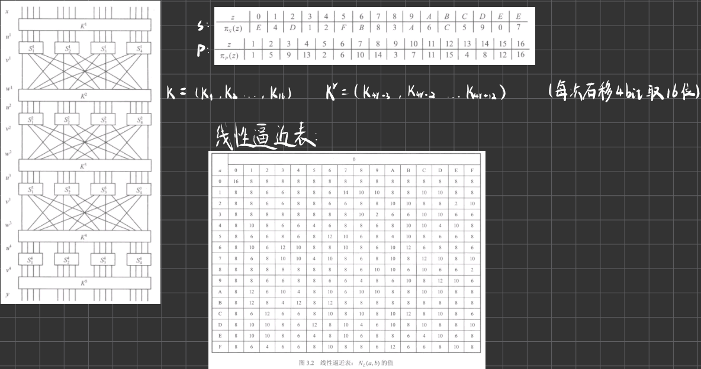
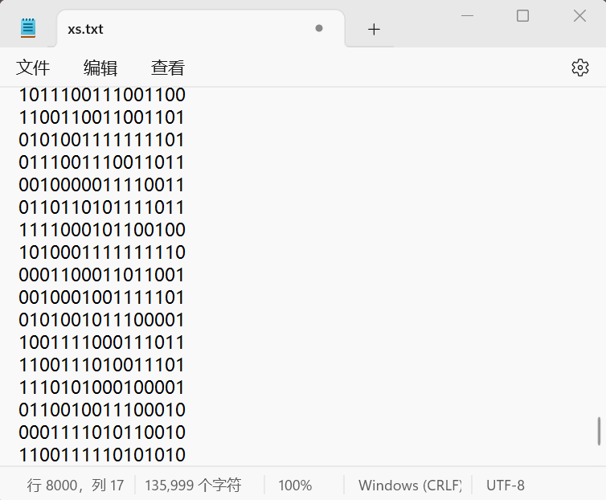
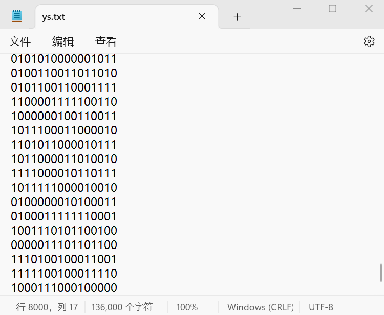
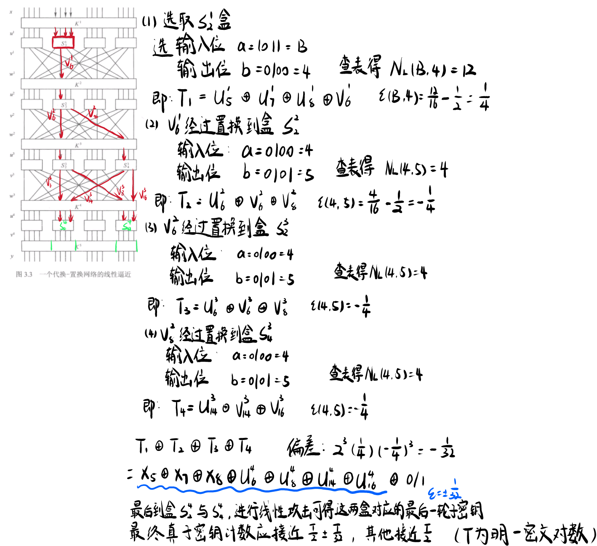
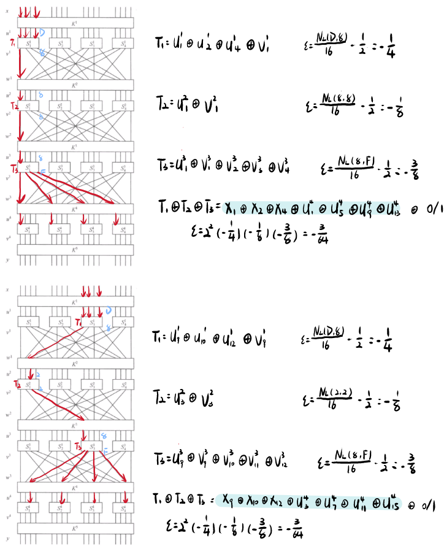
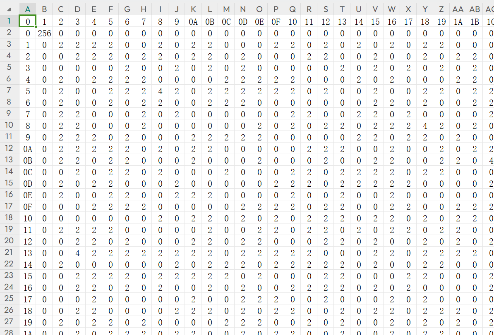

# 线性密码分析确定 SPN 分组加密算法的(轮)密钥

## 一、问题描述

针对书中讲解线性密码分析的SPN例子进行线性密码分析攻击。

SPN加密算法描述以及线性逼近表：



希望通过线性攻击获得加密算法最后一轮的轮密钥。


## 二、操作流程

> 写在前面：
>
> 本次作业全部用Python语言进行编程分析。代码内容都打包在邮件中，报告中只写明关键代码以及分析流程思路。
>
> 笔者将上次实验中的SPN加密函数封装在SPN.py文件中，以下过程中SPN加密都是用的这个函数。

**1、生成 n=8000 对明-密文对**

用书中的密钥K = 0011 1010 1001 0100 1101 0110 0011 1111进行加密。

先随机生成n串16位的二进制串作为密文，写入文件xs.txt中，文件内容示例：



读取文件内容，用SPN加密每一行并输出到ys.txt中，文件内容示例：




**2、进行线性分析**

包括书中进行的一次线性分析在内，一共进行了三次分析。书中已经给出了线性逼近表，这里就从之后的步骤开始分析。

**分析1：**

与书上过程相同，可以获得2、4部分的子密钥：



**分析2、3：**

我们希望通过其他线性分析求得1、3部分的子密钥，但笔者在进行线性分析时尝试只涉及1、3部分密钥的组合，由于偏差太小（都是1/256），在进行攻击时都失败了，第1部分密钥总是不对。

所以需要选取一个偏差较大的组合，即便会涉及到2、4块的密钥，可以直接用分析1中得到的子密钥辅助分析。

以下是最终使用的两个线性分析：




**3、进行线性攻击，得到子密钥**

代码思路为：

1. 为每个密钥维护一个计数器Count，初始值都为0。
2. 对于每一对明密文对，循环尝试所有密钥。将密文中与S盒相关的两个4位与对应密钥进行异或，得到v。
3. 将两个v进行S盒逆映射，得到部分u。
4. 按照分析所得的表达式取出u中需要的比特位，与明文x中的位一起，按照表达式进行异或运算。
5. 如果运算结果为0，该密钥的计数器加1。
6. 遍历所有明密文对后，找出计数器最大的，对应密钥即为最可能的子密钥。

这里笔者将分析2、3结合使用，更改了一下计数器的计数规则，当两个分析的两个表达式结果都为0时，Count才会加1，这样可以增大偏差，提高准确性。

关键代码如下：

```python
# 线性攻击算法# linear_attack(2,4)
def linear_attack1(pairs, T):
    Count = [0] * 256  # 每个密钥的计数器
    for (x, y) in pairs:
        for i in range(256):
            L1 = (i >> 4) & 0xF  # 提取密钥高4位
            L2 = i & 0xF  # 提取密钥低4位
            # 取出四段密文，转为int
            y2 = int(y[4:8], 2)
            y4 = int(y[12:16], 2)

            # 与对应密钥进行异或运算，得到两个v
            v2 = L1 ^ y2
            v4 = L2 ^ y4

            # 逆映射得到u
            u2 = pais_inverse(v2)
            u4 = pais_inverse(v4)

            # 将u转换为二进制字符串并去掉 '0b' 前缀
            # 确保有4位，不足的用前面补0
            u2_str = bin(u2)[2:].zfill(4)
            u4_str = bin(u4)[2:].zfill(4)

            # 计算z
            x5 = int(x[4], 2)
            x7 = int(x[6], 2)
            x8 = int(x[7], 2)
            u6 = int(u2_str[1], 2)
            u8 = int(u2_str[3], 2)
            u14 = int(u4_str[1], 2)
            u16 = int(u4_str[3], 2)
            z = x5 ^ x7 ^ x8 ^ u6 ^ u8 ^ u14 ^ u16

            if z == 0:  # 异或结果为0，对应计数器加1
                Count[i] += 1


    # 最大计数
    maxnum = -1
    maxkey = 0
    for i in range(256):
        Count[i] = abs(Count[i] - T / 2)
        if Count[i] > maxnum:
            maxnum = Count[i]
            maxkey = i

    maxkey_str = bin(maxkey)[2:].zfill(8)
    print("2、4块最可能的子密钥：", maxkey_str)

    return maxkey

# linear_attack(1,3)
def linear_attack2(pairs, T, L2, L4):
    Count = [0] * 256  # 每个密钥的计数器
    for (x, y) in pairs:
        for i in range(256):
            L1 = (i >> 4) & 0xF  # 提取密钥高4位
            L3 = i & 0xF  # 提取密钥低4位

            # 取出四段密文，转为int
            y1 = int(y[0:4], 2)
            y2 = int(y[4:8], 2)
            y3 = int(y[8:12], 2)
            y4 = int(y[12:16], 2)

            # 与对应密钥进行异或运算，得到v
            v1 = L1 ^ y1
            v2 = L2 ^ y2
            v3 = L3 ^ y3
            v4 = L4 ^ y4

            # 逆映射得到u
            u1 = pais_inverse(v1)
            u2 = pais_inverse(v2)
            u3 = pais_inverse(v3)
            u4 = pais_inverse(v4)

            # 将u转换为二进制字符串并去掉 '0b' 前缀
            # 确保有4位，不足的用前面补0
            u1_str = bin(u1)[2:].zfill(4)
            u2_str = bin(u2)[2:].zfill(4)
            u3_str = bin(u3)[2:].zfill(4)
            u4_str = bin(u4)[2:].zfill(4)

            # 计算z
            # 分析2
            x1 = int(x[0], 2)
            x2 = int(x[1], 2)
            x4 = int(x[3], 2)
            x9 = int(x[8], 2)
            x10 = int(x[9], 2)
            x12 = int(x[11], 2)
            u1 = int(u1_str[0], 2)
            u3 = int(u1_str[2], 2)
            u5 = int(u2_str[0], 2)
            u7 = int(u2_str[2], 2)
            u9 = int(u3_str[0], 2)
            u11 = int(u3_str[2], 2)
            u13 = int(u4_str[0], 2)
            u15 = int(u4_str[2], 2)
            z1 = x1 ^ x2 ^ x4 ^ u1 ^ u5 ^ u9 ^ u13
            z2 = x9 ^ x10 ^ x12 ^ u3 ^ u7 ^ u11 ^ u15

            if z1+z2 == 0:  # 二者异或结果都为0，对应计数器加1
                Count[i] += 1


    # 最大计数
    maxnum = -1
    maxkey = 0
    for i in range(256):
        Count[i] = abs(Count[i] - T / 2)
        if Count[i] > maxnum:
            maxnum = Count[i]
            maxkey = i

    maxkey_str = bin(maxkey)[2:].zfill(8)
    print("1、3块最可能的子密钥：", maxkey_str)

    return maxkey
```

程序运行结果如下：

> 2、4块最可能的子密钥： 01101111
> 1、3块最可能的子密钥： 11010011
> 最可能的轮密钥结果： 1101 0110 0011 1111

因为我们已知所用密钥与密钥流规则，可以判断出求得的密钥是正确的。

用其它密钥生成了几个测试样例：

对于K = 0100 0111 0000 1010 1110 0101 1000 1000，程序运行结果如下：

> 2、4块最可能的子密钥： 01011000
> 1、3块最可能的子密钥： 11101000
> 最可能的轮密钥结果： 1110 0101 1000 1000

结果正确。

对于K = 1100 1010 0000 1100 1101 0101 0010 0011，程序运行结果如下：

> 2、4块最可能的子密钥： 01010011
> 1、3块最可能的子密钥： 11011010
> 最可能的轮密钥结果： 1101 0101 1010 0011

结果有一位错。

整体而言正确率在95以上。

# SM4的SBox差分分布表

## 一、问题描述

根据作业题中给出的S盒数据，计算国密分组加密算法SM4的SBox差分分布表。


## 二、操作流程

在课程学习中，我们已经学习了计算差分分布N~D~(x', y')的方法，大致思路如下：

1. 对一个集合Δ(x')，其中有2^m^个异或值为x'的有序对，每一对有序对记为(x, x^*^)
2. 对每一个有序对中的x与x^*^，可以分别通过SBox映射到y与y^*^，通过y异或y^*^，可以得到输出异或y'
3. 计算Δ(x')每一对有序对得到的输出异或，统计每一种y'的次数，即可得到这个x'的输出分布
4. 用同样的方法计算出所有x'的输出分布，将每个x‘作为行号，每一种y'作为列号，即可得到差分分布表，对应表项即为N~D~(x', y')的值。

对于该问题，每一个x'是一个2位十六进制数，即一个8位二进制数，有2^8^=256种情况。对应的，y'也是一个8位二进制数，有2^8^=256种情况。得到的差分分析表是一张256*256的表格。

用Python代码进行运算，将结果输出到differential_distribution.csv，下面展示主要代码：

```python
import csv

# 定义SM4的SBox矩阵。
# 这里定义一个二维数组sbox，大小16*16，在使用时sbox[x高四位][x低四位]，即可得到对应的映射y

# 计算SBox差分分布表,256*256的表格，初始值为0
differ_dis = [[0 for _ in range(256)] for _ in range(256)]

for input_diff in range(256):  # 遍历每一个可能的x'
    for x in range(256):  # 遍历所有可能的输入x
        x_ = x ^ input_diff   # 获得对应的x*
        y = sbox[x >> 4][x & 0xF]  # x分高、低四位对应S盒映射y
        y_ = sbox[x_ >> 4][x_ & 0xF]  # y*
        output_diff = y ^ y_  # 得到y'
        differ_dis[input_diff][output_diff] += 1  # 表格对应位置+1

# 将差分分布表写入differential_distribution.csv文件
# 这里将结果按格式保存到csv文件。输出表头00~FF，之后循环打印differ_dis中的内容，每次打印一个一维数组前打印行号。
```

最终得到差分分布表，给出部分表格内容：


